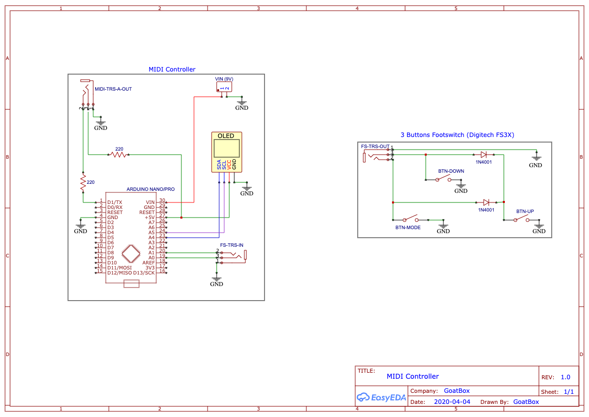
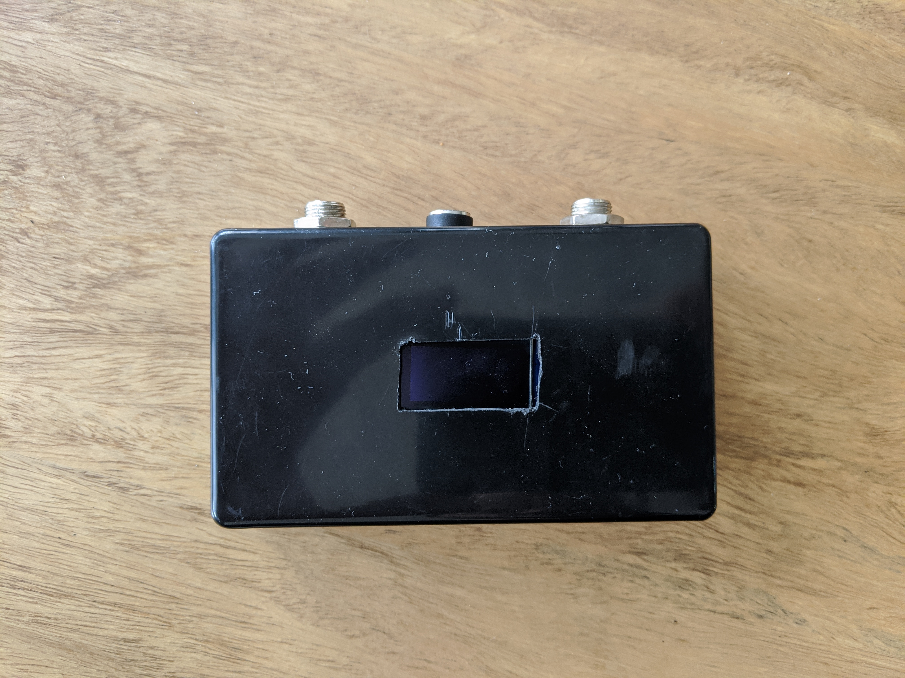
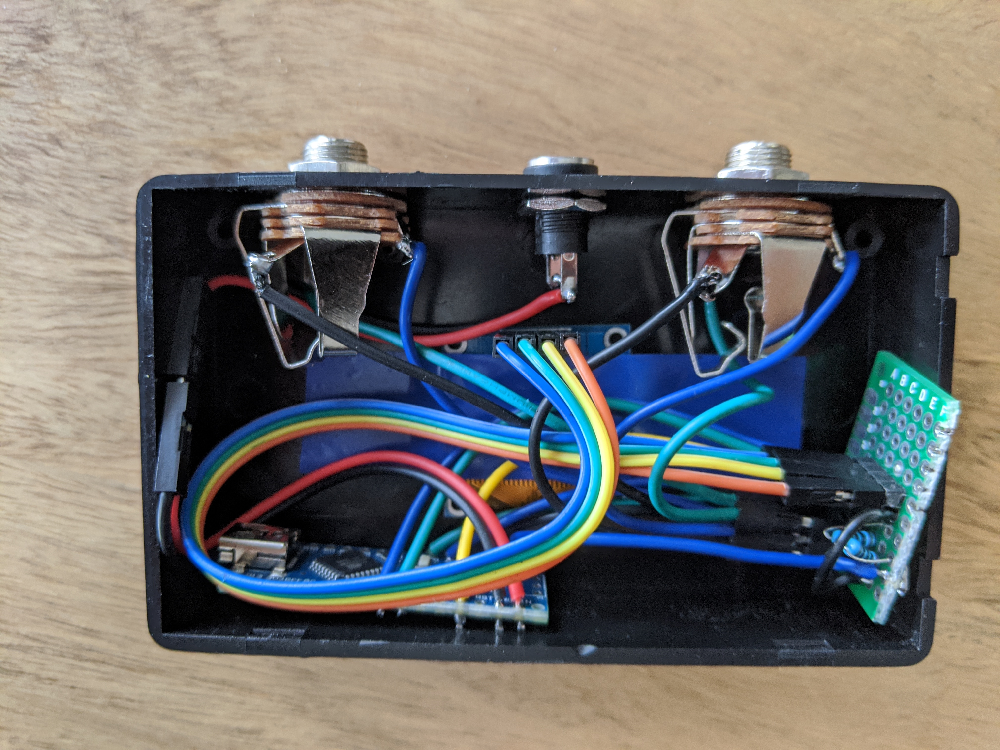
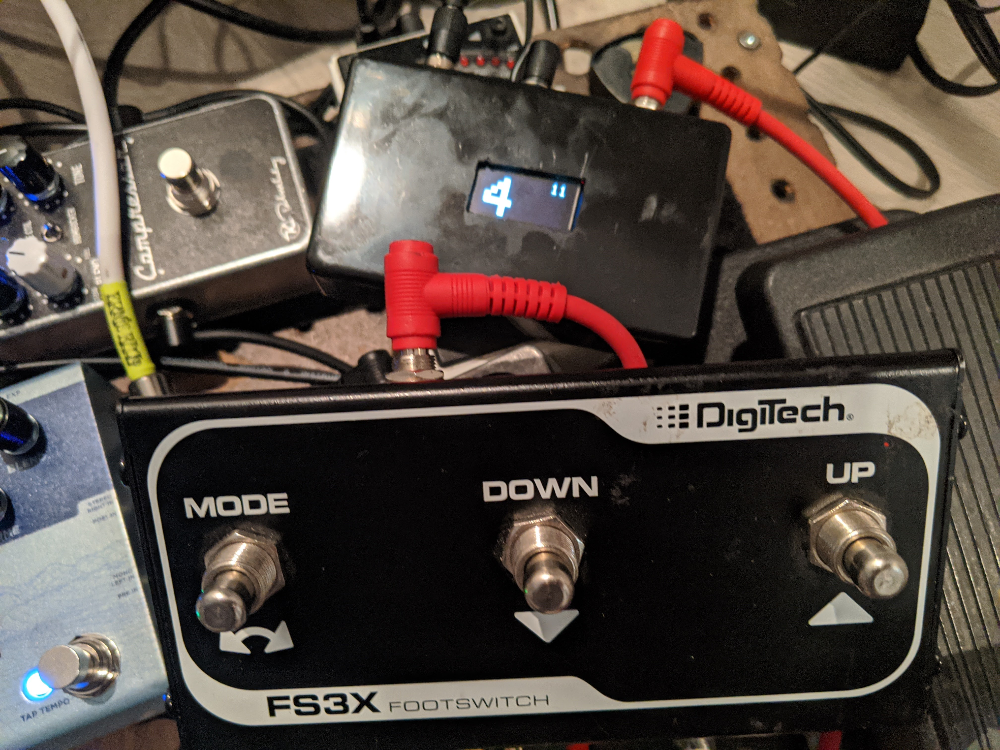

# Arduino MIDI Foot Controller

Simple MIDI foot controller made with an arduino and an external 3 buttons footswitch (type Digitech FS3X).

## Features

- Input Jack for a 3 switches controller (type Digitech FS3X)
- Output Jack MIDI TRS-A
- OLED Display


## Schematic



## Photos

 | 
---------|--------
 | 

## Usage

### MIDI Channel

The controller is sending Program Change (PC) instructions on a MIDI Channel (default 1)

### Main Usage Footswitch Controls

By default, MIDI Channel is number 1. Every PC message will be send on this channel. This setting can be changed through the menu.

#### MODE Button

Pressing MODE button is actually sending the Program Change (PC) to the MIDI output.

If not in `Direct Mode` (default setting), It will display in big the PC number its sending, and remove the small one at the top right of the screen.

In `Direct Mode`, it will re-send the the number displayed on the screen.

Long Press will display the settings menu.


#### UP/DOWN Buttons

If not in `Direct Mode` (default setting), pressing UP or DOWN button will define which PC send when we will press the MODE button.
OLED will display in big the next PC, while displaying the current PC in small at the top right of the screen. 

WARNING: When not in `Direct Mode` UP or DOWN will NOT send the PC instruction. It will just select it for pressing MODE.


In `Direct Mode`, pressing UP or DOWN will up or down the Progam Change of 1 and actually send the message. It will not wait the MODE button press to send PC change.


### Settings Menu

A long press onto the MODE button will display the settings menu. Navigate with UP and DOWN button, and enter a setting by pressing MODE.

Available settings are the following:
- MIDI Channel: select the MIDI channel for the controller. Only one channel is available for all PC messages.
- Blink Before Change: When not in `Direct Mode`, blink screens until MODE is pressed and PC message is sent.
- Direct Mode: In this mode, send PC message as soon as UP or DOWN button is pressed. Do not wait MODE press to actually send MIDI message. 


## Building With `arduino-cli` To An Arduino Nano Clone

https://arduino.github.io/arduino-cli/

### Setup

```bash
brew install arduino-cli
arduino-cli core update-index
arduino-cli core install arduino:avr
```

### Build

```bash
arduino-cli compile --libraries libraries midi-controller
arduino-cli compile --fqbn arduino:avr:pro --libraries libraries midi-controller
```

### Upload

Find port where board is connected
```bash
arduino-cli board list
```

Upload
```bash
arduino-cli upload -p /dev/cu.usbserial-1420 --fqbn arduino:avr:pro  midi-controller
```
