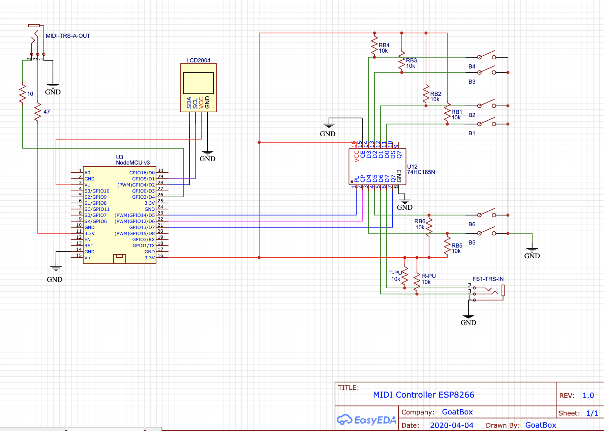

# Using Micropython on ESP32 DevKit board

## Tools

### Useful Links

https://docs.micropython.org/en/latest/esp32/quickref.html
https://www.digikey.ca/en/maker/projects/micropython-basics-load-files-run-code/fb1fcedaf11e4547943abfdd8ad825ce

### Local Virtualenv

Using pyenv-virtualenv `micropython`: `pyenv virtualenv activate micropython`

```shell
pip install -r requirements.txt
```

### Flash firmware

Erase and flash on ESP32 (option to erase at the same time is not working)
WARNING: Using more recent firmware (or custom) is not working yet

```shell
python -m esptool --port /dev/tty.usbserial-0001 erase_flash
python -m esptool --port /dev/tty.usbserial-0001 --chip esp32 --baud 460800 write_flash -z 0x1000 firmware/esp32-20210902-v1.17.bin
```

#### Build Firmware

Building in docker image:

```shell
docker build -f firmware/Dockerfile -t midigoat .
docker run --rm -ti --volume $PWD/firmware:/root/export midigoat /bin/bash -c "cp /micropython/ports/esp32/build-GENERIC/firmware.bin /root/export/esp32-generic-midigoat.bin"
```

Firmware is located in the image at `/micropython/ports/esp32/build-GENERIC/firmware.bin`

### Test live

```shell
ampy --port /dev/tty.usbserial-0001 run src/main.py
```

### Upload file

Don't forget to remove `pyc` files!

```shell
find . | grep -E "(__pycache__|\.pyc|\.pyo$)" | xargs rm -rf
```

```shell
ampy --port /dev/tty.usbserial-0001 put src/wifi.py /wifi.py
ampy --port /dev/tty.usbserial-0001 put src/midicontroller /midicontroller
ampy --port /dev/tty.usbserial-0001 put banks_dir /banks_dir
ampy --port /dev/tty.usbserial-0001 put src/main.py /main.py
```

or from the rshell

```
rsync presets /pyboard/presets
rsync banks_existenza /pyboard/banks
rsync src/midicontroller /pyboard/midicontroller
cp src/wifi.py /pyboard/
cp src/main.py /pyboard/
```

### Connect to REPL

#### Using `screen`

```shell
screen /dev/tty.usbserial-0001 115200
```
exit with `Ctrl-A; Ctrl-\`

#### Using `rshell`

```shell
rshell -p /dev/tty.usbserial-0001
```
exit with `Ctrl-D`

from `rshell`
```shell
repl
```
exit with `Ctrl-X`

#### Free Flash Space

From REPL

```python
import uos
fs_stat = uos.statvfs('/')
fs_size = fs_stat[0] * fs_stat[2]
fs_free = fs_stat[0] * fs_stat[3]
print("File System Size {:,} - Free Space {:,}".format(fs_size, fs_free))
```

## Wiring Schema

R-Tx = 10 Ohm

R-V3.3 = 47 Ohm



Note: Connect 74HC165 to Pin D3 (GPIO0) make the board fail to boot.

## External Libraries Used

https://github.com/adafruit/Adafruit_CircuitPython_MIDI
- added `__str__` to `MIDIMessage`, `ProgramChange` and `ControlChange` classes

https://github.com/dhylands/python_lcd
